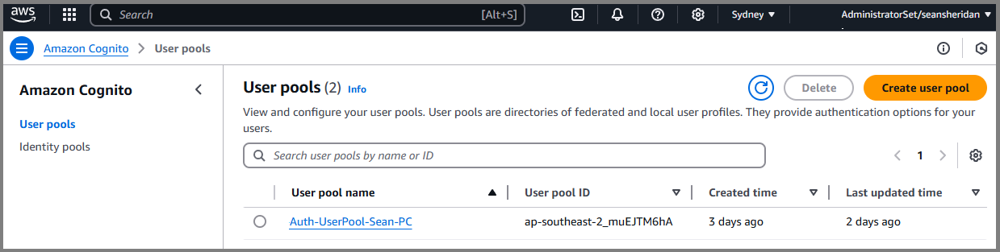

# AWS Amplify Gen 2 - Authentication Flow

\*\* This article is currently in development.

User Authentication - easy, I know how it works.... or at least, that's what I first thought when I first set out on this journey.

User sign-up and login flows may seem straightforward since everyone has navigated them before, and they rarely change. So, why discuss these processes in detail?

As we dive into December 2024, you might have noticed that the AWS Amplify Gen 2 documentation on authentication flows still leaves a bit to be desired, mainly because of the recent transition from Gen 1. So, I thought, why not write up a helpful article to deepen our understanding of these user authentication flows? Let's jump right in and explore together!

Typical user authentication flows are broken down in to 2 main categories:

**New User**

* Lands on the Signup page - fills in details and submits the form
* Is prompted with a One Time Password (OTP) sent to the users mobile or email
* Enters the OTP and then gains access to the application

**Existing/Returning User**

* IF logged in, is directed to the main landing page
* IF logged out, is directed to the Login page
* IF password is forgotten, then the user has the option to reset password etc.

This is nothing we haven't seen before. But understanding how to implement this within React Native code is a lot more challenging.

Firstly, and most importantly, it's essential to understand which parts of your application need to be secured. For example, an unauthenticated user should not be able to access the "Dashboard" page.

If you want to secure the entire app, requiring users to either sign up or log in, you should ensure the Root Layout is wrapped in \<Authenticator /> tags. This guarantees that IF the user is logged out, they can only gain access to the Login screen, and not any other page/screen within the app.

The method described above is the most common approach with regards to app authentication, and the one we use in our React Native application.

To help visualize the OAuth flow, I’ve created the diagram below. This flow uses the default authentication levels in Cognito, where authentication codes are sent to the user only during the Sign-Up and Reset Password stages.

\*\* Please note that this Authentication flow does not include Social and Custom Sign-In/Sign-Up providers like Facebook or Google.

<figure><figcaption>
AWS Amplify (Gen 2) - User Authentication Flow
</figcaption></figure>

### Cognito User-Pool

Let’s talk briefly about AWS Cognito.

You will want to create a user-pool and select the options that best suit your application. It’s important to note that you will not be able to make changes to your User-Pool after it has been created, so please ensure that you set it up accurately!

You will need to setup the following:

1\.       Select the Application type that best suits you.

2\.       Name your User-Pool.

3\.       Select the Options for Sign-in.

4\.       Select the attributes that you want to require from users upon Sign-up.

👉 **Tip:** Request more information than you think you will require – this will decrease the likelihood of you haven’t to create a new User-Pool.

<figure><figcaption>
AWS Cognito - Create a User-Pool
</figcaption></figure>

Once you are satisfied with the User-Pool settings, click “Create”.

You will then see your User-Pool within the Cognito Dashboard:

<figure><figcaption>
AWS Cognito - Successful Creation of a User-Pool
</figcaption></figure>

