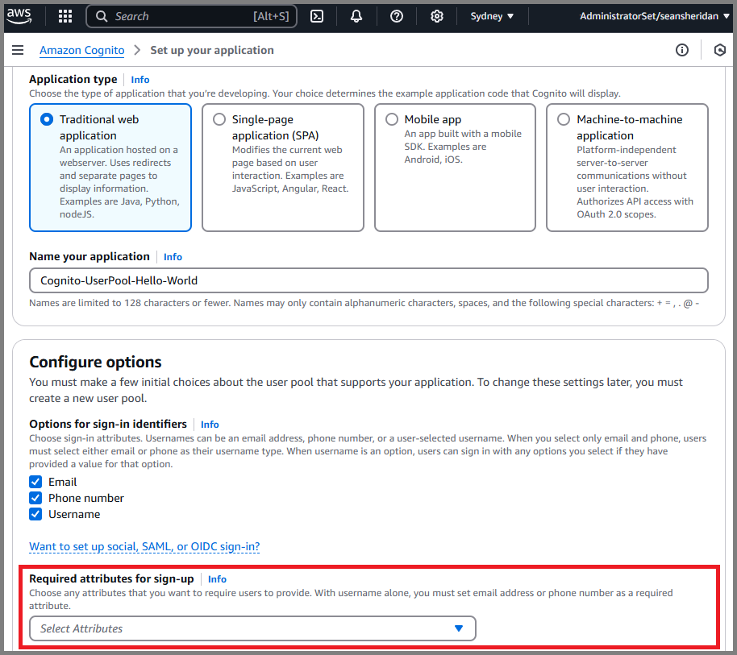
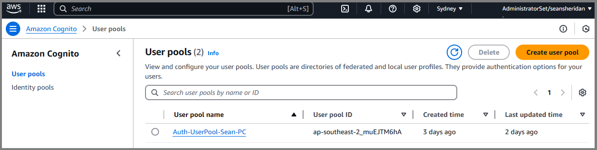

# AWS Cognito - User Pool Creation & Setup

### Cognito User-Pool

Let’s talk briefly about AWS Cognito.

You will want to create a user-pool and select the options that best suit your application. It’s important to note that you will not be able to make changes to your User-Pool after it has been created, so please ensure that you set it up accurately!

You will need to setup the following:

1\.       Select the Application type that best suits you.

2\.       Name your User-Pool.

3\.       Select the Options for Sign-in.

4\.       Select the attributes that you want to require from users upon Sign-up.

👉 **Tip:** Request more information than you think you will require – this will decrease the likelihood of you haven’t to create a new User-Pool.

5. Input your redirect URL - if you are testing in a local environment (localhost), you can input this address for now.

<figure><figcaption>
AWS Cognito - Create a User-Pool
</figcaption></figure>

Once you are satisfied with the User-Pool settings, click “Create”.

You will then see your User-Pool within the Cognito Dashboard:

<figure><figcaption>
AWS Cognito - Successful Creation of a User-Pool
</figcaption></figure>

### Social Sign-In

A great feature in AWS Cognito is the "Social Sign-In" option, which is highlighted in the image below.&#x20;

This feature offers seamless integration with popular platforms like Facebook and Google, providing more flexibility in how users sign-in. Based on my research, enabling sign-ups via Google and Facebook can boost user registration rates by building trust and offering a quicker, simpler sign-in process.

Setting up social sign-ups in the AWS console is straightforward, but you must complete all necessary steps in both the Google console and Meta developer portal (with Meta being more complex).&#x20;

Feel free to reach out to me on [**LinkedIn**](https://www.linkedin.com/in/seaneugenesheridan/) if you need any tips for setting up Meta!

<figure><figcaption>
AWS Cognito - Social Sign-In
</figcaption></figure>

### Messasge Templates

An essential step in configuring AWS Cognito is customizing your "Message Templates." While AWS provides default, generic messages, you have the flexibility to personalize them to better align with your brand.&#x20;

In this section, you can modify the templates using standard formatting for a more tailored experience.

<figure><figcaption>
AWS Cognito - Customised Message Templates
</figcaption></figure>

Now that your AWS Cognito User-Pool is successfully set up and configured, we can move on to the AWS Amplify Authentication flows - this will be detailed in future articles.

Wishing you all a Merry Christmas and a Happy New Year 🥳🌲 - see you in 2025!
