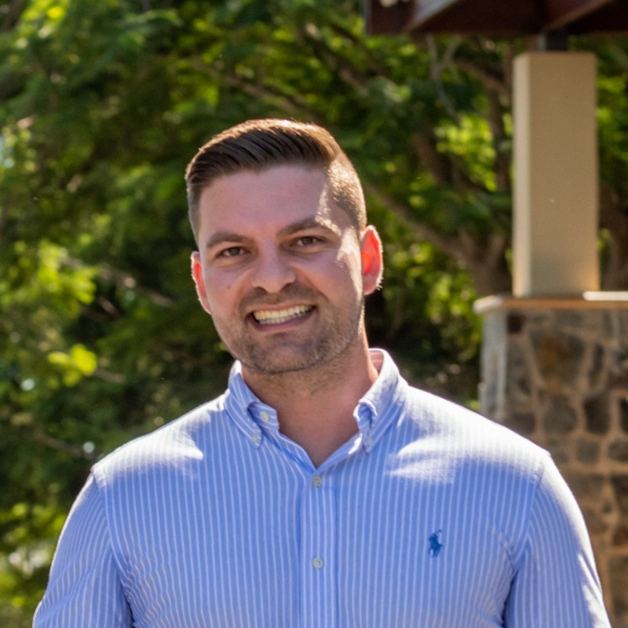

# About Me

<figure><figcaption>
Howdy Git Fam 👋
</figcaption></figure>

As of late 2024, I am currently working as a Rail Engineer at WSP in Melbourne Australia 🇦🇺 , where I design and deliver major rail infrastructure projects for local communities on behalf of the Victorian State Government.

In my spare time, I enjoy exploring the tech space to advance my knowledge. Some of my standout achievements to date include:

🚀 **Catapulted a Blockchain Startup:** I was part of a dynamic 5-person global team that transformed a blockchain startup from a mere idea into a $2.5 Billion powerhouse in just three years. My contributions spanned strategy, business development, team growth and training, platform bug finding, and UI/UX refinement. This platform has since generated an impressive $125 million in profit (figures as of mid-2024) 📈.

🌟 **Founded SocialPal:** I co-founded SocialPal, an innovative FinTech payments application on the blockchain. Since its launch in mid-2024, SocialPal has onboarded over 10,000 users and integrated more than 10 blockchains, revolutionizing the way people manage their finances and transact online. MasterCard has since followed in the same footsteps 👀

🔧 **Designed Whitelist Central:** I played a pivotal role in designing and optimizing Whitelist Central, a Web3 DApp for creating tiered milestone-based contests with seamless social media integration. Launched in early 2024, this platform has already generated over $150,000 in TTV, demonstrating the value of innovative solutions.

From designing and delivering complex Level Crossing Removal projects at WSP to advancing developments in tech, I am driven by a passion for innovation, problem-solving, and pushing boundaries.

Let’s be friends — feel free to send me a DM on LinkedIn if you wish! 🙂.\
**Link:** [https://www.linkedin.com/in/seaneugenesheridan/](https://www.linkedin.com/in/seaneugenesheridan/)&#x20;
